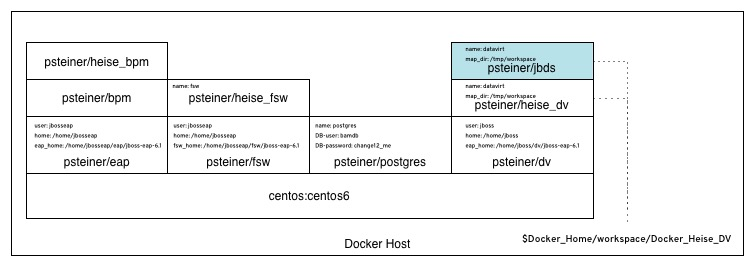

= Getting JBoss Data Virtualization to run in the Demo

:Author:    Patrick Steiner
:Email:     psteiner@redhat.com
:Date:      07.12.2014

:toc:

== Prerequisites

=== Salesforce.com Demo Account
In this demo we will use JBoss Data Virtualization to 

	1. access data from a Postgres database
	2. access data from a Salesforce.com account
	3. join these two to one virtual database

The installer for this demo will take care of the creation of the Postgres database, but in order to work with Salesforce.com you will need your companies account for Salesforce.com or a free-of-charge demo account.

To register for a demo account please do follow the https://www.salesforce.com/form/signup/freetrial-sales.jsp[instructions] from Salesforce. +
As we will be using Salesforce.com via their API, you need to also register for a https://success.salesforce.com/answers?id=90630000000glADAAY[security token]. 

Details on how to create the correct datarecords will be covered at a later step in this manual.

=== Dockerhost
The entire demo is build on https://www.docker.com/[Docker]. The various elements, like JBoss BPM Suite, JBoss Fuse, Postgres and JBoss Data Virtualization all run in their own container. 

Shows an overview on how these Docker images are build on each other. We will cover the details in the relevant sections later in this manual.

Please do follow the instructions on how to install Docker on your host, based on the https://docs.docker.com/installation/[relevant pages] from Docker.com

=== Maven, Ant & JDK
As our installation procedure will build a few jars for you convenience, please do have the appropriate tools up and running on your Docker host.

== Building the Demo Environment

=== Getting the code

The procedure to build the various requried Docker container has been automated for your convenience, all you need to do is to clone the most current version of the demo from github
----
git clone https://github.com/PatrickSteiner/BPM_FSW_DV_Docker.git 
----

=== Customizing the code
JBoss Data Virtualization needs to know your Salesforce.com login and password to be able to retrieve data. To add your credetials to this environment, please open `./HEISE_DV_Image/config/standalone.xml` in your editor of choice and search for the section
----
<resource-adapter id="Salesforce_DS">
	<module id="org.jboss.teiid.resource-adapter.salesforce" slot="main"/>
	<transaction-support>NoTransaction</transaction-support>
	<connection-definitions>
		<connection-definition class-name="org.teiid.resource.adapter.salesforce.SalesForceManagedConnectionFactory" enabled="true" jndi-name="java:/Salesforce_DS" pool-name="Salesforce_DS">
			<config-property name="password">
				[your password+security-token] 
            </config-property>
			<config-property name="username">
				[your login]				   
            </config-property>
		</connection-definition>
	</connection-definitions>
</resource-adapter>
----
Replace `[your password+security-token]` and `[your login]` with your personal data.

=== Providing the Red Hat JBoss Products
I have not included the various JBoss products in the git repository, so it will be your obligation to retrieve them and to place them in their directories.

	* `jboss-eap-6.1.1.zip` into `./EAP_Image`
	* `jboss-bpms-6.0.3.GA-redhat-1-deployable-eap6.x.zip` into `./BPM_Image`
	* `jboss-fsw-installer-6.0.0.GA-redhat-4.jar` into `./FSW_Image`
	* `jboss-dv-installer-6.0.0.GA-redhat-4.jar`into `DV_Image/software`
	* `jbdevstudio-product-universal-7.1.1.GA-v20140314-2145-B688.jar` into `DV_JBDS_Image/software`
	* `jbdevstudio-product-universal-7.1.1.GA-v20140314-2145-B688.jar` into `BPM_JBDS_Image/software`	

=== Building the Docker container

After changing into the `BPM_FSW_DV_Docker` directory, all you need to do is run the provided script, take a cup of coffee ( make it a big one ) and start
----
./demo.sh build all
----

Once the creation of the 

== Creating the VDB - Virtual Database

== Creating a WebService

== How to add it all to the demo