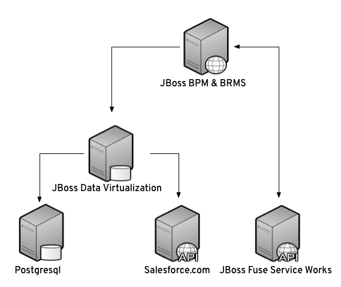

= Getting JBoss Data Virtualization to run in the Demo

:Author:    Patrick Steiner
:Email:     psteiner@redhat.com
:Date:      07.12.2014

:toc:

== What it's all about
This demo has been build to demostration a combination of various Red Hat JBoss products, aimed to have something to demo them and to get an idea on how to achieve an integration.

The scenario covered is the request for a household insurance and is build upon the following services.

Please check https://github.com/PatrickSteiner/BPM_FSW_DV_Docker/tree/master/Documentation[here] for detailed instructions.
